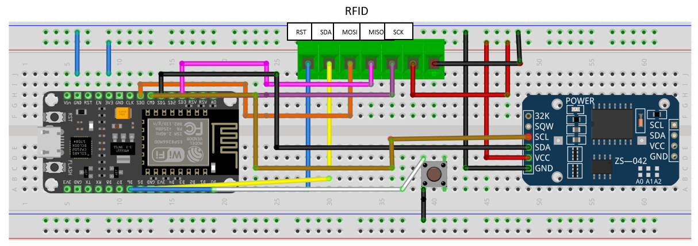
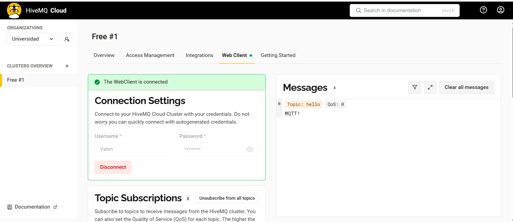
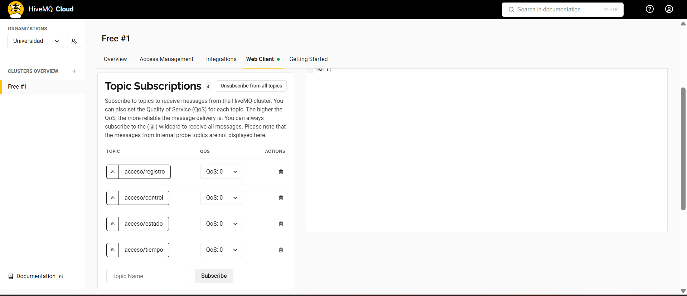

# Sistema de Control de Acceso con RTC,ESP32, RFID y MQTT

Este proyecto implementa un sistema de control de acceso utilizando una ESP32, un lector RFID MFRC522 y un reloj en tiempo real RTC DS3231.  
El sistema permite registrar, validar y eliminar tarjetas RFID, almacenando los UIDs en la memoria EEPROM y comunicándose con un broker MQTT seguro en la nube.

## Características principales

- Registro y validación de tarjetas RFID (MFRC522).  
- Almacenamiento de UIDs en EEPROM.  
- Control de accesos con hora exacta mediante RTC DS3231.  
- Comunicación con la nube mediante MQTT.  
- Posibilidad de eliminar tarjetas de forma remota vía MQTT.  
- Funcionamiento en multitarea (FreeRTOS) con tres tareas principales:  
  - Lectura de RFID.  
  - Conexión y mensajes MQTT.  
  - Publicación de la hora actual.  

## Hardware requerido

- **ESP32**  
- **Lector RFID MFRC522**  
- **RTC DS3231**  
- **Botón físico**  
- **Fuente de alimentación 5V**  

---

## Estructura del sistema

- **TaskRFID** → Detecta tarjetas y gestiona accesos.  
- **TaskMQTT** → Mantiene la conexión y procesa mensajes del broker.  
- **TaskRTC** → Envía la hora actual cada 5 segundos.  

### Tópicos MQTT usados

- `acceso/registro` → Mensajes de registro o eliminación de tarjetas.  
- `acceso/estado` → Resultado de accesos (permitido o denegado).  
- `acceso/tiempo` → Hora actual enviada.  
- `acceso/control` → Canal de comandos (ejemplo: `ELIMINAR:UID`).  

## Funcionamiento

1. El ESP32 se conecta al WiFi y al broker MQTT.  
2. El usuario pasa una tarjeta por el lector RFID.  
3. Si el sistema está en modo registro (activado por el botón físico):  
   - El UID se guarda en EEPROM.  
   - Se notifica por MQTT: `Nueva tarjeta registrada`.  
4. Si no está en modo registro:  
   - UID válido → acceso permitido.  
   - UID inválido → acceso denegado.  
5. El usuario puede eliminar tarjetas enviando por MQTT

## Descricpción del codigo

### Librerías y definición

### Librerías utilizadas

- `#include <WiFi.h>`
- `#include <PubSubClient.h>`
- `#include <Wire.h>`
- `#include <EEPROM.h>`
- `#include <SPI.h>`
- `#include <MFRC522.h>`
- `#include "RTClib.h"`
- `#include <WiFiClientSecure.h>`

- Librerías: habilitan WiFi, MQTT, EEPROM, SPI, RFID, RTC y conexión segura TLS.
- SS_PIN y RST_PIN → pines del lector RFID.
- BUTTON_PIN → botón que activa el modo registro.

## Obtener la hora:

String getHora() {
  DateTime now = rtc.now();
  char buffer[30];
  sprintf(buffer, "%02d:%02d:%02d", now.hour(), now.minute(), now.second());
  return String(buffer);
}

Devuelve la hora actual del RTC DS3231 en formato HH:MM:SS.

### Guardar UID en EPROM, verificar UID y eliminar UID:

void saveUID(String uid) { ... }

- Busca un espacio vacío en EEPROM.
- Guarda el UID de la tarjeta RFID.
- Añade un \0 al final y hace commit para que se guarde

bool uidExists(String uid) { ... }

- Recorre la EEPROM leyendo UIDs almacenados.
- Si encuentra coincidencia, devuelve true.

void deleteUID(String uid) { ... }

- Busca el UID en EEPROM. Si lo encuentra, lo borra.Publica en MQTT el mensaje de “Tarjeta eliminada”.Si no está, avisa "UID no encontrado".

### Interrupciones

-Boton registro:

void IRAM_ATTR registrarISR() {
  registroPendiente = true;
}

- Cuando se presiona el botón, se activa registroPendiente. Indica que la próxima tarjeta detectada debe guardarse.

### Tareas FreeRTOS:

## Tarea RFID:
 
void taskRFID(void *pvParameters) {
  static bool mostrarRegistro = false;
  for (;;) {

     if (registroPendiente && !mostrarRegistro) {
      client.publish("acceso/registro", "Modo registro activado, pase de nuevo la tarjeta");
      mostrarRegistro = true;
    }
    if (rfid.PICC_IsNewCardPresent() && rfid.PICC_ReadCardSerial()) {
      String uid = "";
      for (byte i = 0; i < rfid.uid.size; i++) {
        uid += String(rfid.uid.uidByte[i], HEX);
      }

      if (registroPendiente) {
        registroPendiente = false;
        mostrarRegistro = false;
        saveUID(uid);
        String msg = "Nueva tarjeta registrada: " + uid + " - Hora: " + getHora();
        client.publish("acceso/registro", msg.c_str());
      } else {
        if (uidExists(uid)) {
          String msg = "ACCESO PERMITIDO - UID: " + uid + " - Hora: " + getHora();
          client.publish("acceso/estado", msg.c_str());
        } else {
          String msg = "ACCESO DENEGADO - UID: " + uid + " - Hora: " + getHora();
          client.publish("acceso/estado", msg.c_str());
        }
      }
      rfid.PICC_HaltA();
      rfid.PCD_StopCrypto1();
    }
    vTaskDelay(500 / portTICK_PERIOD_MS);
  }
}

- Detecta si hay una tarjeta cerca.Si está en modo registro, guarda el UID en EEPROM, Si no, verifica si existe:
- UID válido - “ACCESO PERMITIDO”.
- UID inválido - “ACCESO DENEGADO”.
- Publica el resultado en MQTT.

### Tarea MQTT:

void taskMQTT(void *pvParameters) {
  for (;;) {
    if (!client.connected()) reconnect();
    client.loop();
    vTaskDelay(100 / portTICK_PERIOD_MS);
  }
}

- Mantiene la conexión con el broker.
- Ejecuta client.loop() para procesar mensajes entrantes.

### Tarea del RTC:

void taskRTC(void *pvParameters) {
  for (;;) {
    String hora = getHora();
    client.publish("acceso/tiempo", hora.c_str());
    vTaskDelay(5000 / portTICK_PERIOD_MS);
  }
}

- Obtiene la hora actual con getHora().
- La publica en el tópico "acceso/tiempo" cada 5 segundos.

## Setup

void setup() {...}

- Inicializa comunicación serie y EEPROM, se conecta al WiFi y al broker MQTT, inicializa SPI, RFID y RTC,Configura el botón con interrupción y lanza las tres tareas principales (RFID, MQTT, RTC).

## Void Loop

Vacío porque el programa funciona con tareas paralelas en FreeRTOS.

## Simulación del circuito

Para la simulación del circuito se emplearon borneras con el fin de representar el módulo RFID. Asi mismo, aunque en la imagen de la ESP32 no se distinguen con claridad los pines, las conexiones se realizaron en los pines correspondientes.

##  Conexiones

### ESP32 ↔ MFRC522 (RFID)

| MFRC522 | ESP32   |
|---------|---------|
| VCC     | 3.3V    |
| GND     | GND     |
| RST     | GPIO 27 |
| SDA     | GPIO 5  |
| MOSI    | GPIO 23 |
| MISO    | GPIO 19 |
| SCK     | GPIO 18 |

---

### ESP32 ↔ RTC DS3231

| RTC DS3231 | ESP32   |
|------------|---------|
| VCC        | 3.3V    |
| GND        | GND     |
| SDA        | GPIO 21 |
| SCL        | GPIO 22 |

---

### Botón de Registro

| Botón | ESP32   |
|-------|---------|
| Pin 1 | GPIO 15 |
| Pin 2 | GND     |

---

## Conexión MQTT

Se utilizó **HiveMQ** como broker MQTT.

**Interfaz HiveMQ:**

  

