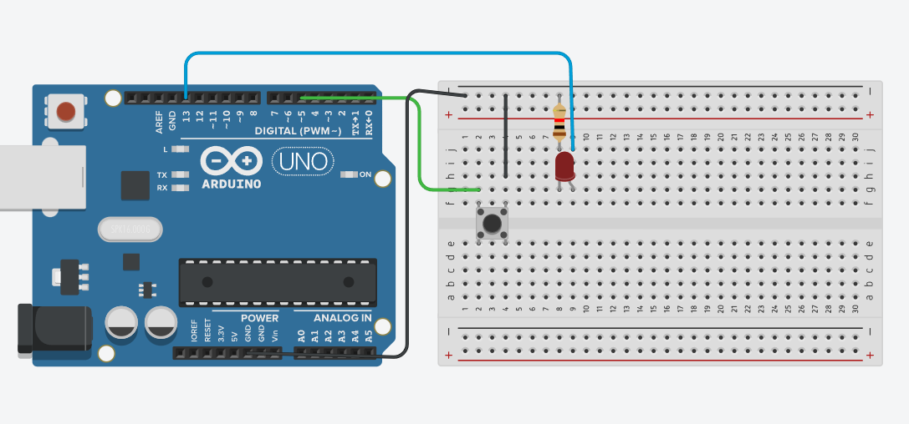

# ENCENDER UN LED

Este programa permite encender y apagar un LED conectado al pin 13 de un Arduino mediante un botón pulsador conectado al pin 5.

## Cómo funciona

El botón usa una resistencia interna de pull-up, por lo que al estar en reposo lee un valor HIGH, y cuando se presiona, un LOW.

Cada vez que se detecta una transición de HIGH a LOW (pulsación), el estado del LED se invierte:

Si estaba apagado, se enciende.
Si estaba encendido, se apaga.

Se utiliza una variable para recordar el estado anterior del botón y así evitar lecturas erróneas.

## Circuito en Tinkercad

<<<<<<< HEAD
Simulación en Tinkercad:  
=======
Simulación en Tinkercad  
>>>>>>> bfeacd1 (Actualizar Readme2)
 [Simulación en Tinkercad](https://www.tinkercad.com/things/fhzLDvUXmN4)

 Imagen del circuito

