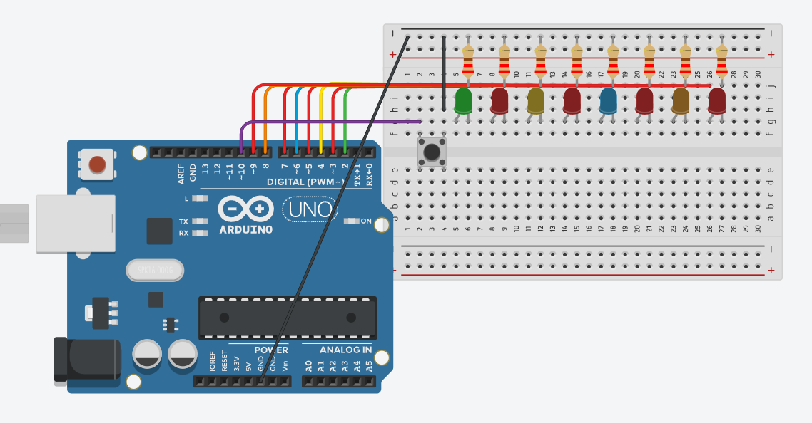

# 8 LEDS

Este programa en Arduino controla 8 LEDs conectados a los pines digitales 2 al 9, y un botón pulsador en el pin 10.

## Cómo funciona

Los 8 pines de los LEDs se configuran como salida.
El pin del pulsador se configura como entrada con resistencia pull-up interna.

Cuando se mantiene presionado el botón, los LEDs se encienden uno por uno con un retardo de 500 ms entre cada LED.
Si se siguen encendiendo todos los LEDs, el programa espera a que se suelte el botón.

Una vez que el botón se libera, los LEDs se apagan en orden inverso, también con un retardo de 500 ms entre cada apagado.

## Circuito en Tinkercad

 [Circuito en Tinkercad](https://www.tinkercad.com/things/lsbWHMrUVug-brilliant-curcan/editel?returnTo=https%3A%2F%2Fwww.tinkercad.com%2Fdashboard)

  Imagen del circuito
 
