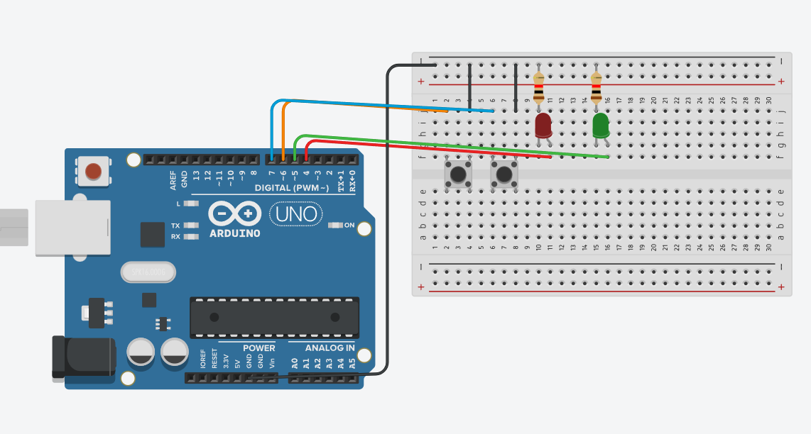

# Alternar Leds

Este programa en Arduino controla 2 LEDs y 2 pulsadores:
LED1 conectado al pin 4.
LED2 conectado al pin 5.
Pulsador 1 en el pin 6.
Pulsador 2 en el pin 7.

## Cómo funciona

Los LEDs se configuran como salida.
Los pulsadores se configuran como entrada con resistencia pull-up interna

Al presionar el pulsador 1, se activa un bucle infinito en el que:
LED1 se enciende y LED2 se apaga durante 150 ms.
Luego LED1 se apaga y LED2 se enciende durante 150 ms.
Esto crea un efecto de alternancia rápida entre los dos LEDs.

Mientras los LEDs alternan, si se presiona el pulsador 2, el bucle se interrumpe y el parpadeo se detiene.

## Circuito en Tinkercad

[Circuito](https://www.tinkercad.com/things/8g0ociW64PZ-alternarleds/editel?returnTo=https%3A%2F%2Fwww.tinkercad.com%2Fdashboard%2Fdesigns%2Fcircuits&sharecode=vP3ivum-BfGT8EbSWVgSfj_I6ywR5aLdyrd2ky0UdFM)

Imagen del circuito

