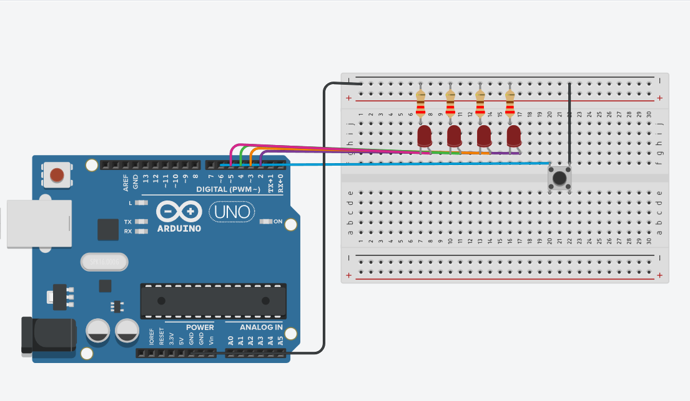

# BINARIOS

Este programa muestra números en binario usando 4 LEDs conectados a un Arduino.

## ¿Cómo funciona?

Cada LED representa un bit (0 o 1).
Con un botón (pulsador) se va aumentando el número que se muestra, empezando desde 0 hasta 15.
Cuando llega a 15, vuelve a empezar en 0.
Los LEDs se encienden y apagan de acuerdo al valor binario del número actual.

Por ejemplo:
Número 3 en binario es 0011, por lo que se encienden los dos primeros LEDs.
Número 12 en binario es 1100, por lo que se encienden los dos últimos LEDs.

[Circuito](https://www.tinkercad.com/things/l0YnglqhynG-binarios?sharecode=i-SLLV-IyTTQIpKQmkfmKCtwPX4_eVo3aBc5c5s3YKo)

Imagen del circuito

