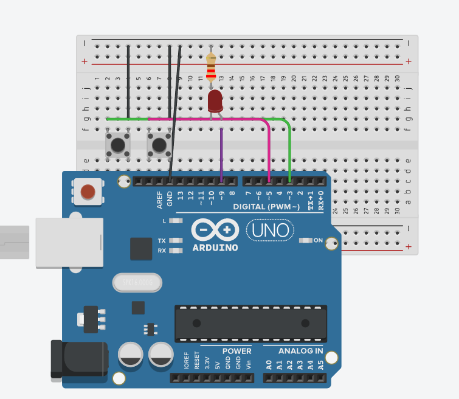

# Control de brillo

Este programa permite controlar el brillo de un LED usando dos botones conectados a un Arduino.

## ¿Cómo funciona?

El LED está conectado al pin 9 (que permite salida PWM).
Un botón (en el pin 3) sirve para aumentar el brillo poco a poco.
Otro botón (en el pin 5) sirve para disminuir el brillo.
El brillo va de 0 (apagado) hasta 255 (máximo brillo).
Cada pulsación cambia el brillo en pasos de 5 unidades, con una pequeña pausa para evitar lecturas demasiado rápidas.

## Circuito en Tinkercad

[Circuito en Tinkercad](https://www.tinkercad.com/things/8HkcfleN1O8-pwm?sharecode=NegbO6yc98e19ohcAR0IPJzOzTofu-bAJCqe0Qb_Yww)

## Imagen del circuito

