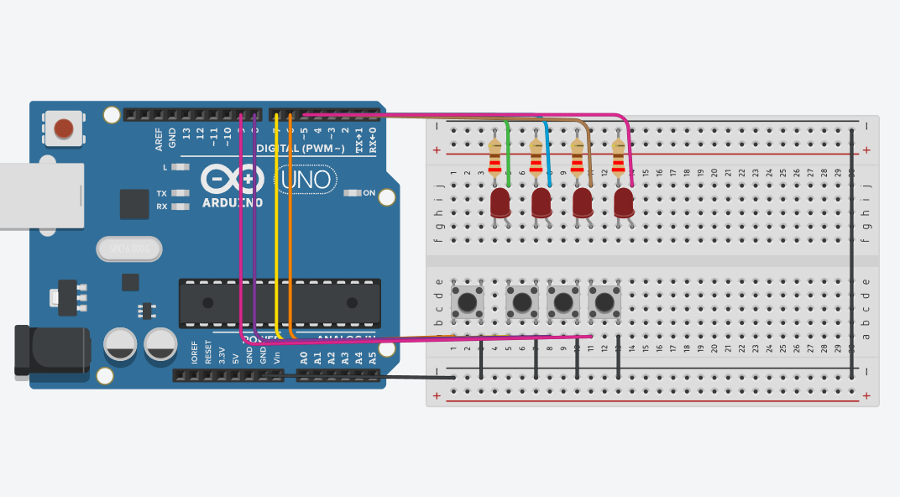

# Memoria de secuencia

Este programa implementa un mini juego de memoria con Arduino, parecido a “Simón dice”

## ¿Cómo funciona?

Hay 4 LEDs (pines 2, 3, 4, 5) y 4 botones (pines 6, 7, 8, 9).

El Arduino guarda una secuencia de 20 pasos, donde cada paso corresponde a un LED y a un botón.
En cada nivel:
El Arduino muestra la secuencia actual encendiendo los LEDs uno por uno.
El jugador debe repetir la secuencia presionando los botones correctos.
Si el jugador se equivoca en cualquier paso, el juego se reinicia desde el nivel 0.
Si acierta toda la secuencia, avanza al siguiente nivel, que será un poco más largo.

## Simulación del circuito

[Circuito en Tinkercad](https://www.tinkercad.com/things/ikIBXlJxkWc-secuencia?sharecode=sxwbo-oGbUQR_Kbi41kxEydu0S5Roo7pJCxgKK3dLVo)

## Imagen del circuito

