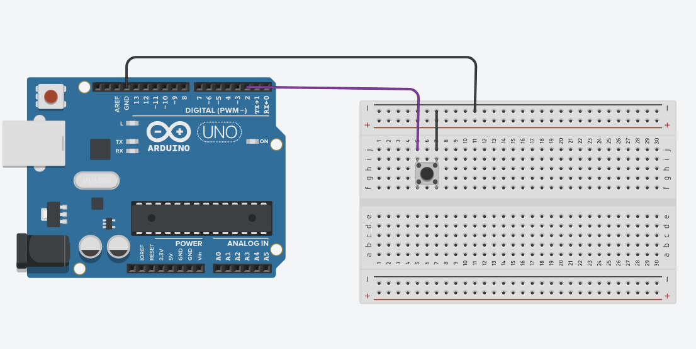

# Contador con boton

Este código utiliza una interrupción externa en Arduino para contar cuántas veces se presiona un botón conectado al pin 2.

## ¿Cómo funciona?

-Se declara una variable global contador que aumenta en uno cada vez que ocurre la interrupción.
-La interrupción se configura con attachInterrupt(), detectando el flanco de bajada (FALLING) del botón.
-Dentro de la función principal loop(), el valor del contador se guarda en la variable boton y se imprime en el monitor serial.
De esta manera, cada vez que se presiona el botón, el número mostrado en el monitor serial se incrementa en uno.

## Simulación del circuito

[Circuito en Tinkercad](https://www.tinkercad.com/things/bfmc1hQEcyU-contador-con-interrupciones?sharecode=SXDoCsDZ0jXJvtEitKMxd0rpHa82Ep8Wog57eHxfKOc)

## Imagen del circuito

