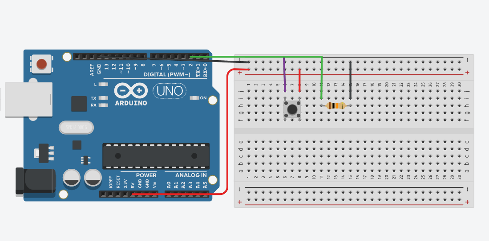

# Descripción

Este programa mide la frecuencia de una señal digital conectada al pin 2 del Arduino, utilizando interrupciones externas y el Timer1 en modo CTC.

## ¿Cómo funciona?

Cada vez que llega un pulso al pin 2, la interrupción externa ejecuta la función contarPulsos(), que incrementa la variable contadorPulsos.
El Timer1 se configura para generar una interrupción cada 1 segundo.
En la rutina ISR(TIMER1_COMPA_vect), se guarda el número de pulsos en la variable frecuencia y se reinicia el contador.
En el loop(), el valor de frecuencia se envía por el monitor serial en Hz (pulsos por segundo).

El Arduino cuenta los pulsos que entran por el pin 2 durante 1 segundo y muestra ese número como la frecuencia en Hz en el monitor serial.

## Simulación del circuito

[Circuito en Tinkercad](https://www.tinkercad.com/things/crrNBz8NEQx-medicion-de-frecuencia?sharecode=4ajOQfsvBDv0dB5Tbevqv5GojG5EyNfDVXRn6zBd9ls)

## Imagen del circuito

