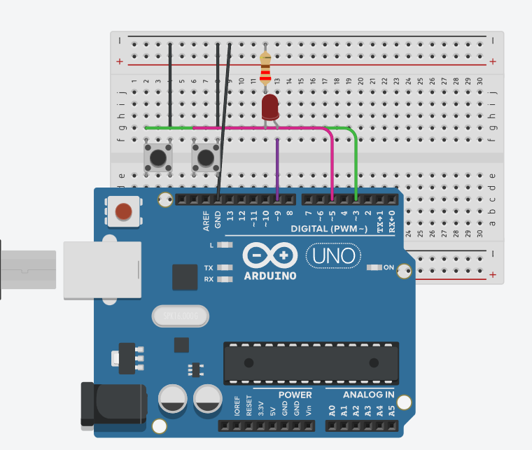

# Control de PWM con interrupción

Este código controla el brillo de un LED conectado al pin 9 de Arduino, utilizando PWM (modulación por ancho de pulso) y una interrupción externa para invertir la dirección del cambio de brillo.

## ¿Cómo funciona?

La variable brillo determina la intensidad del LED (de 0 a 255).
Cada 50 milisegundos el valor de brillo aumenta o disminuye en pasos de 5.
El pin 3 está conectado a un botón con resistencia interna de pull-up.
Al presionar el botón, se activa una interrupción que ejecuta la función cambiarDireccion(), invirtiendo la dirección del cambio de brillo.
El valor actual de brillo también se envía al monitor serial.

En resumen, el LED se va iluminando y apagando de manera gradual, y el botón permite cambiar la dirección del efecto en cualquier momento.

## Simulación del circuito

[Circuito en Tinkercad](https://www.tinkercad.com/things/8HkcfleN1O8-pwm?sharecode=NegbO6yc98e19ohcAR0IPJzOzTofu-bAJCqe0Qb_Yww)

## Imagen del circuito

