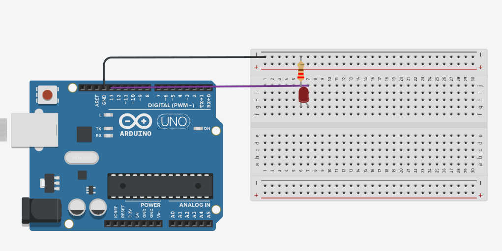

# Temporizador interno para parpadeo preciso

Este programa hace parpadear el LED del pin 13 usando el Timer1 del Arduino en modo CTC.
En lugar de usar delay(), se configura un temporizador interno para generar una interrupción cada 500 ms.

## ¿Cómo funciona?

Cuando la interrupción ocurre, se ejecuta la función ISR(TIMER1_COMPA_vect), que invierte el estado del LED.
De esta forma, el LED se enciende y se apaga de manera alternada, logrando un parpadeo estable de 1 Hz (medio segundo encendido y medio segundo apagado).
Esto demuestra cómo usar los timers internos para controlar el tiempo con mayor precisión y sin bloquear la ejecución del programa.

## Simulación del circuito

[Circuito en Tinkercad](https://www.tinkercad.com/things/bEjdJQPDEKF-timmer?sharecode=cw8b_tyL7yO00DLUwuEbbIxonYCO-86Pf70P6cY0Pn8)

## Imagen del circuito

