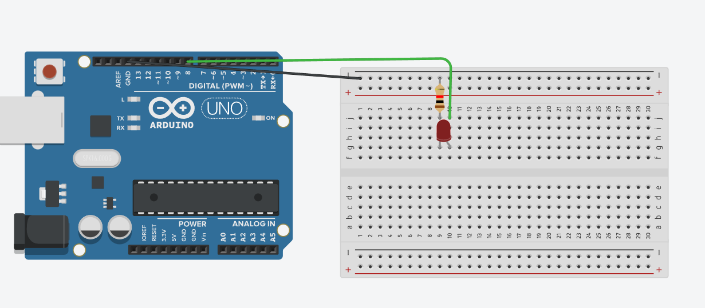

# Configuración Persistente con EEPROM en Arduino  

Este programa implementa un sistema de configuración persistente usando un Arduino y la memoria EEPROM.  
El usuario puede elegir, a través del monitor serie, entre tres opciones de velocidad de parpadeo de un LED.  

La opción seleccionada se guarda en la EEPROM, de modo que, incluso si el Arduino se reinicia o se desconecta, la configuración se mantiene y se restaura automáticamente al volver a encender.  

---

## ¿Cómo funciona?

- Se lee desde la EEPROM la última opción guardada.  
- Si no hay un valor válido, se asigna la opción por defecto (1 = Lento).  
- Se muestra un menú en el monitor serie:  

     MENU CONFIGURACION:
     1 = Lento (1s)
     2 = Medio (0.5s)
     3 = Rapido (0.2s)
     Configuracion actual: X

- El usuario ingresa un número (`1`, `2` o `3`) desde el monitor serie.  
- El valor ingresado se guarda en la EEPROM y se actualiza la configuración actual.  
- Dependiendo de la opción seleccionada, el LED conectado al pin **8** parpadea con diferentes velocidades:   - **Opción 1** → Lento  
**Opción 2** → Medio  
**Opción 3** → Rápido  

## Simulación del circuito

[Circuito en Tinkercad](https://www.tinkercad.com/things/7MHTotq2LM9-configuracion-persistente?sharecode=r_-v1qRhylTT4_jChnCYev64on8wJswTExsruB-bq6U)

## Imagen del circuito

