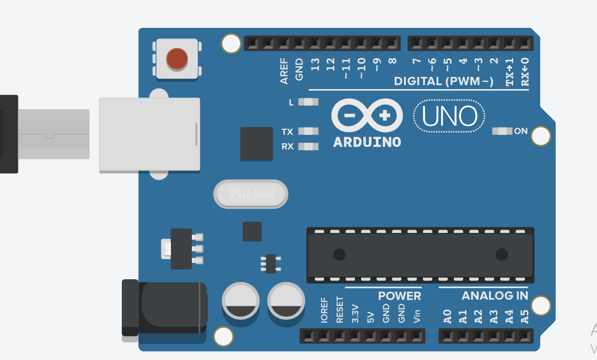

# Contador de encendidos

Este código utiliza la memoria EEPROM del Arduino para contar cuántas veces la placa se ha encendido.

## ¿Cómo funciona?

Se define la dirección 0 de la EEPROM para guardar el contador de encendidos.
En el setup(), se lee el valor almacenado en esa dirección y se guarda en la variable contador.
El contador se incrementa en 1 cada vez que el Arduino se inicia.
Con EEPROM.update(), el nuevo valor se guarda de forma permanente en la memoria, sin desgastar innecesariamente la EEPROM.
Finalmente, el número de encendidos se muestra en el monitor serial.

Cada vez que el Arduino se apaga y vuelve a encenderse, el contador aumenta y se guarda en la memoria. De esta forma, el número de encendidos se mantiene aunque el Arduino se reinicie o se corte la alimentación.

## Simulación del circuito

[Circuito en Tinkercad](https://www.tinkercad.com/things/3Jn0npEwYG7-contador-de-encendidos?sharecode=TFyi058J7Q8XPceaH9MWeUHx9NbA_jRC5mA9as-3ov8)

## Imagen del circuito

